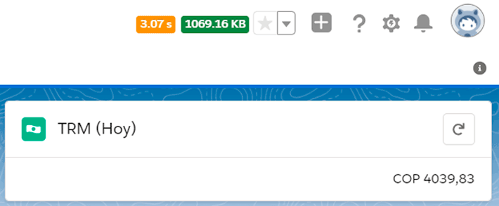

*** 
##  <center> TRM Colombia </center>
*** 
  
  Te permite mantener la TRM para Colombia al día, la cual es obtenida desde una base de datos confiable.

#### Ejemplo de componente


**Nota:** Considera que no debes usar la configuración avanzanda de tus monedas en SalesForce, debido a que no surgiría efecto en tus monedas.
***  
## 📋 Requerimientos 

* Configura tus monedas en tu ORG

1. Ingresa a configuraciones de tu ORG
2. Ingresa al administrador de monedas
3. Verifica que el botón Advanced Currency este en "Enable"
4. Agrega las monedas COP y USD (Mira el .gif siguiente)


*** 
## Problemas conocidos

- No registrados
*** 


## 🔧 Notas de la versión 
## **new** v1.0 
```
- Componente (TRM Colombia) - disponible
```
